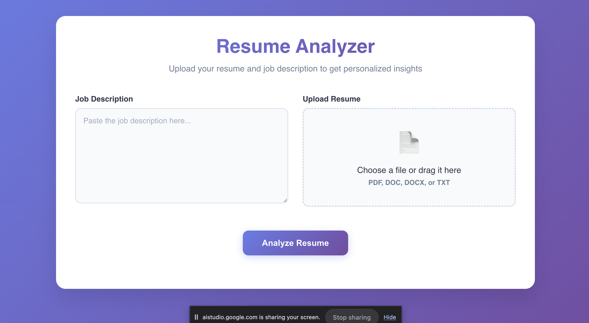
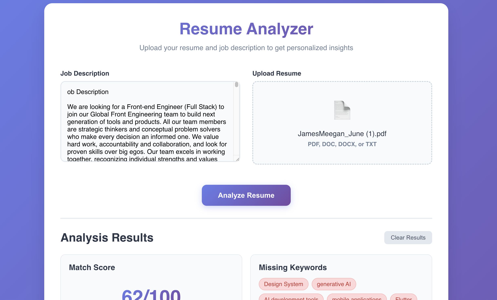
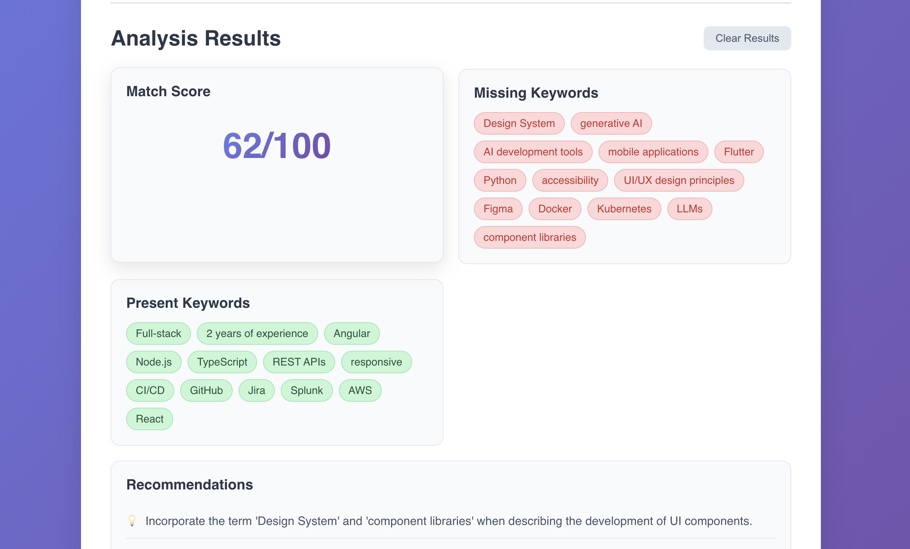
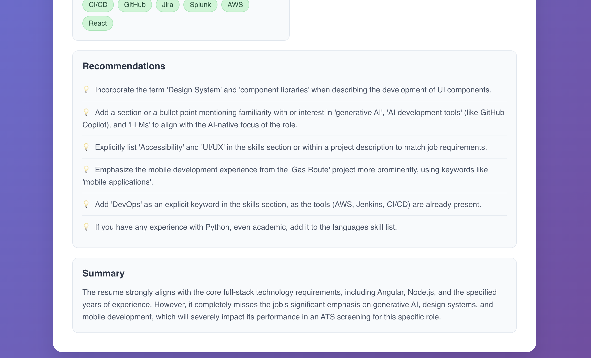

# AI-Powered Resume Analyzer

A web application that analyzes resumes against job descriptions using Google Gemini AI, providing ATS-focused feedback and actionable recommendations.

## Features
- Upload your resume and a job description
- Get keyword analysis, match score, and improvement suggestions
- AI-powered feedback tailored for Applicant Tracking Systems (ATS)

## Technologies Used
- **Frontend:** React
- **Backend:** Node.js, Express
- **AI Integration:** Google Gemini (GenAI)
- **File Parsing:** pdf-parse, multer

## Getting Started

### Prerequisites
- Node.js (v16+ recommended)
- npm or yarn
- Google Gemini API key (set as `GEMINI_API_KEY` in your environment) 
- To get API key go to https://aistudio.google.com/app/apikey and create a new key 

### Installation
1. **Clone the repository:**
   ```bash
   git clone https://github.com/jmeegan2/Targeted_Resume
   cd Targeted_Resume
   ```
2. **Install backend dependencies:**
   ```bash
   cd server
   npm install
   ```
3. **Install frontend dependencies:**
   ```bash
   cd ../frontend
   npm install
   ```

### Running the App
1. **Start the backend server:**
   ```bash
   cd server
   npm start
   ```
2. **Start the frontend app:**
   ```bash
   cd ../frontend
   npm start
   ```
3. **Open your browser:**
   Visit [http://localhost:3000](http://localhost:3000)

### Environment Variables
- Set your Google Gemini API key in a `.env` file in the `server` directory:
  ```env
  GEMINI_API_KEY=your_api_key_here
  ```

## License
MIT 

## Photos

### Default


### Picture 1


### Picture 2


### Picture 3
 

